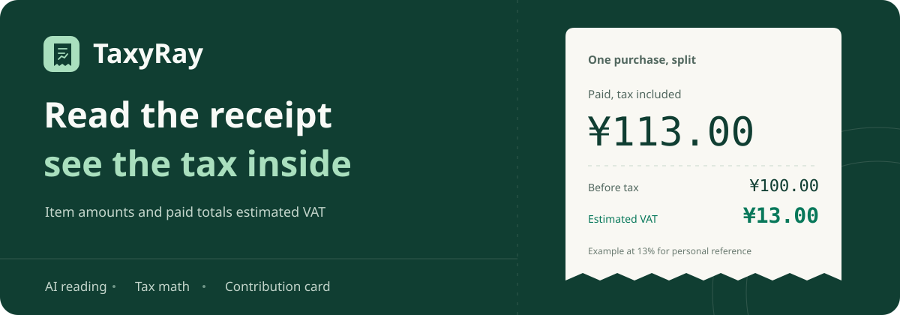

<p align="center">
  
</p>

<h1 align="center">TaxyRay</h1>

<p align="center">
  <strong>Read the receipt  see the tax inside</strong><br/>
  Scan a bill or pick a screenshot, then get the price and the tax for every item
</p>

<p align="center">
  <a href="https://github.com/Changjingjiu/TaxyRay/releases/latest"></a>
  
  <a href="https://github.com/Changjingjiu/TaxyRay/actions/workflows/android.yml"></a>
  <a href="LICENSE"></a>
</p>

<p align="center">
  <a href="https://github.com/Changjingjiu/TaxyRay/releases/latest"><strong>Download for Android</strong></a> ·
  <a href="README.md">中文</a> ·
  <a href="CHANGELOG.md">Changelog</a> ·
  <a href="https://github.com/Changjingjiu/TaxyRay/issues">Report an issue</a>
</p>

## What this is

Bring your own AI service and TaxyRay reads paper receipts, shopping screenshots and e-bills, splits what you paid into a pre-tax amount and tax, and keeps a local ledger of it. The model only reads the bill — every amount is recomputed on your phone in exact decimal and integer-cent arithmetic, and nothing is booked until you confirm it.

> What you see is the VAT included in the price you paid. It is not a sum of every tax, not what the merchant actually remits, and not a tax certificate

## Features

- **Bill reading** Paper receipts, shopping screenshots and e-bills, up to 5 images and 30 orders per round
- **Price and tax per item** 13% / 9% / 6% / 0% and custom rates, with the working and the rate sources shown
- **Discounts and rounding** Order-level discounts spread across items in proportion, with the leftover cent assigned by largest remainder
- **One-tap review** Book the paid, unambiguous bills in one go, with duplicate checks against your ledger and against the same batch
- **Payment status check** Skip unpaid orders; unclear ones need your confirmation and the real paid total
- **Contribution card** Share the estimated tax of a single bill or of the whole ledger, in two templates

## Screens

<table>
  <tr>
    <td align="center" width="50%"></td>
    <td align="center" width="50%"></td>
  </tr>
  <tr>
    <td align="center">Estimated tax and recent bills</td>
    <td align="center">Several bills at once, reviewed one by one or in one tap</td>
  </tr>
  <tr>
    <td align="center"></td>
    <td align="center"></td>
  </tr>
  <tr>
    <td align="center">Order-level discounts spread by paid amount</td>
    <td align="center">Every item gets its own pre-tax amount and tax</td>
  </tr>
</table>

<sub>Android 16 emulator screenshots with demo data — not an actual AI reading. The app UI is Chinese-only for now</sub>

<table>
  <tr><th width="50%">Paper</th><th width="50%">Forest</th></tr>
  <tr>
    <td></td>
    <td></td>
  </tr>
</table>

<sub>Exports are at least 1080 px wide; the haptic and confetti feedback never lands in the image</sub>

## Getting started

1. Download the APK from [Releases](https://github.com/Changjingjiu/TaxyRay/releases/latest) and install it on Android 8.0 or later
2. In **Settings → Receipt AI**, enter your service URL, a model that supports images and tool calling, and your own API key
3. Tap **Scan bills** on the home screen, take photos or pick images, then review each bill and confirm

You can also add a bill by hand — the ledger and the math work without a network connection

[Recognition rules and limits](docs/AI_RECOGNITION.md) · [Algorithm and boundaries](docs/ALGORITHM.md) · [Tax policy](docs/TAX_POLICY.md)

## Data and privacy

- Your ledger, scan drafts and API settings stay on the device; no account, no ads, no telemetry
- The API key is encrypted with the Android Keystore and never included in a backup
- The app goes online only when you start a scan, and only to the endpoint you configured
- Backups are plain JSON / CSV — keep them somewhere safe before switching phones

[Privacy](docs/PRIVACY.md) · [Security reports](SECURITY.md) · [Updates and signing](docs/UPDATES.md)

## Development

Kotlin · Jetpack Compose · Room · OkHttp. Requires JDK 17 and Android SDK 35

```bash
./gradlew :core:test :app:testDebugUnitTest :app:lintDebug :app:assembleDebug
```

[Build and test](docs/DEVELOPMENT.md) · [Contributing](CONTRIBUTING.md) · [MIT License](LICENSE) · [Third-party notices](THIRD_PARTY_NOTICES.md)
