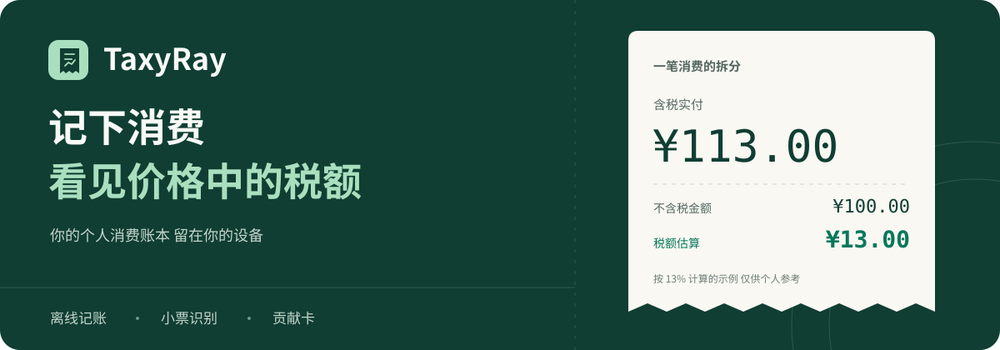
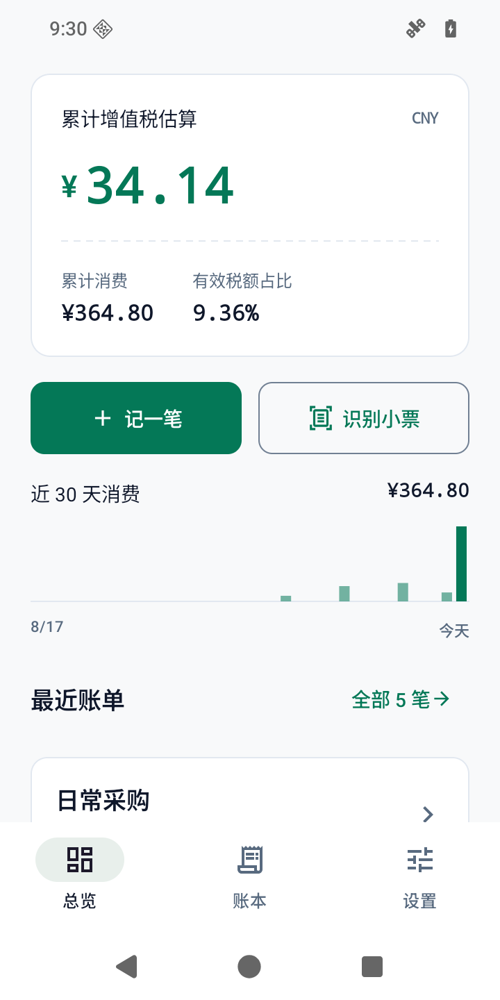
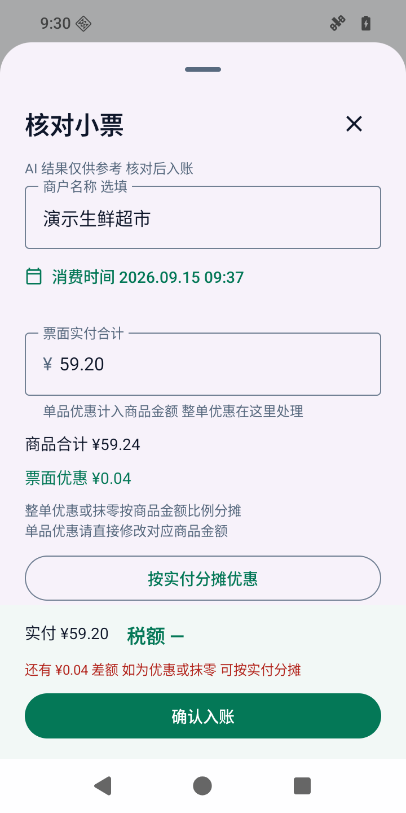
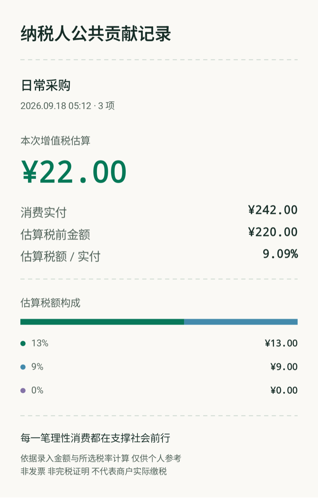
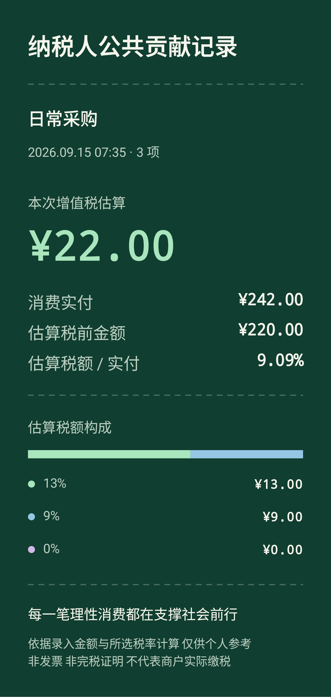

<p align="center">
  
</p>

<h1 align="center">TaxyRay</h1>

<p align="center">
  <strong>接入 AI 识别小票 自动估算消费价格中的税额</strong><br/>
  拍照或选图 识别商品与实付金额 看清每一项的价与税
</p>

<p align="center">
  <a href="https://github.com/Changjingjiu/TaxyRay/releases/latest"></a>
  
  <a href="https://github.com/Changjingjiu/TaxyRay/actions/workflows/android.yml"></a>
  <a href="LICENSE"></a>
</p>

<p align="center">
  <a href="https://github.com/Changjingjiu/TaxyRay/releases/latest"><strong>下载 Android 版</strong></a> ·
  <a href="#开始使用">开始使用</a> ·
  <a href="CHANGELOG.md">更新记录</a> ·
  <a href="https://github.com/Changjingjiu/TaxyRay/issues">反馈问题</a>
</p>

## 买东西时 价格里含了多少税

TaxyRay 想回答的就是这个问题

接入你自己的 AI 服务 拍一张小票或从相册选图 AI 提取商品 实付金额与优惠信息 并建议商品分类 应用自动完成逐项价税拆分 你可以查看依据 调整金额与税率 再保存结果

**AI 负责读懂小票 本机负责精确计算** 记账只是保存和回看结果的方式

> 当前估算的是消费价格中包含的增值税 不是所有税种的合计 也不代表商户实际缴库的税款

## 从一张小票到税额明细

<table>
  <tr>
    <th width="50%">AI 小票算税</th>
    <th width="50%">整单优惠与抹零</th>
  </tr>
  <tr>
    <td></td>
    <td></td>
  </tr>
  <tr>
    <td align="center">拍照或选图 自动识别商品与金额</td>
    <td align="center">按实际支付金额计算 优惠也算清楚</td>
  </tr>
</table>

<sub>v0.2.2 模拟器截图 使用演示数据 核对页为预置演示草稿 不代表一次真实 AI 请求</sub>

| 核心能力 | 做了什么 |
| --- | --- |
| **AI 小票识别** | 识别商户 日期 商品行 实付与优惠 分类后建议税率 不清楚的内容留给你调整 |
| **自动税额估算** | 逐项计算不含税金额与税额 展示计算过程 支持 13% / 9% / 6% / 0% 与自定义税率 |
| **优惠与抹零分摊** | 比如商品合计 ¥59.24 实付 ¥59.20 确认后将 ¥0.04 按金额比例分摊到各项 再计算税额 |
| **税率依据** | 每档税率单独展示 点击商品类别查看典型代表与适用条件 |
| **贡献卡** | 将一笔消费的税额估算生成图片 选择纸本或松石绿 保存或分享 |

## 把结果留成一张卡

每一笔理性消费都在支撑社会前行

<table>
  <tr><th width="50%">纸本</th><th width="50%">松石绿</th></tr>
  <tr>
    <td></td>
    <td></td>
  </tr>
</table>

<sub>应用导出的演示图片 导出宽度至少 1080 像素 生成时的一次触觉和彩纸反馈不进入图片</sub>

## 开始使用

1. 从 [Releases](https://github.com/Changjingjiu/TaxyRay/releases/latest) 下载 **TaxyRay APK** 安装到 Android 8.0 及以上设备
2. 在 **设置 → 小票识别AI** 填写服务地址 支持图片与工具调用的模型 以及自己的 API Key
3. 回到首页 点击 **识别小票** 拍照或选图 确认发送后开始识别
4. 查看识别结果与税额 明细有误时直接修改 有整单优惠时确认分摊 保存后可生成贡献卡

识别图片会访问你配置的服务 可能产生 API 费用 手动录入和本地计算无需联网

<details>
<summary><strong>小票 AI 配置示例</strong></summary>

| 设置项 | 填写示例 |
| --- | --- |
| API 地址 | `https://api.deepseek.com` |
| 模型名称 | `deepseek-flash` |
| API Key | 你自己的服务密钥 |
| 自动追加 `/chat/completions` | 开启 |

其他服务须支持图片输入与 Function Calling 也可以关闭自动追加并填写完整请求地址

测试连接只验证简短文本请求 不代表模型已经通过图片识别测试 图片只会在你确认后发送至所选服务

[识别规则与边界](docs/AI_RECOGNITION.md)

</details>

<details>
<summary><strong>保存 回看与备份</strong></summary>

识别结果由你确认后才入库 账本用于搜索 回看 编辑与删除这些记录 也可以手动录入一笔消费

数据保存在本机 没有账号 广告或遥测 API 配置通过 Android Keystore 加密 密钥不进入备份

支持导出和导入 JSON / CSV 备份为明文 换设备前自行保存 目前没有云端账本同步

[隐私说明](docs/PRIVACY.md) · [安全问题反馈](SECURITY.md)

</details>

<details>
<summary><strong>旧版本如何更新</strong></summary>

**0.2.1 及更早版本需要下载 0.2.2 的 APK 覆盖安装一次 不要先卸载**

这次仓库改名 同时更换了更新地址 旧版更新器不能跟随这次地址变更 安装身份和签名保持不变

0.2.2 起使用新仓库 可通过 **设置 → 检查更新 → 下载更新 → 安装更新** 获取后续版本 更新包经过大小 SHA-256 包名 版本和签名校验 最后由 Android 确认安装

[更新与签名说明](docs/UPDATES.md)

</details>

## 计算可以逐项核对

```text
税额 = 含税金额 × 税率 ÷ (1 + 税率)
不含税金额 = 含税金额 − 税额
```

实付 **¥113.00** 按 **13%** 拆分 得到税额 **¥13.00** 和不含税金额 **¥100.00**

每个商品单独四舍五入到分 再汇总整单 金额使用精确十进制和整数分计算 不让 AI 直接决定最终计算结果

整单优惠按商品金额比例分摊 尾差用最大余数法补齐 不把差额塞到最后一项 单品已有会员价时直接使用折后金额 仅部分商品参与优惠时修改对应商品

所选税率不一定等于商户实际适用税率 结果仅供个人参考 贡献卡不是发票 完税证明或申报依据

[算法与边界](docs/ALGORITHM.md) · [税率依据](docs/TAX_POLICY.md) · [税率分类说明](docs/TAX_RATE_GUIDE.md)

## 开发与贡献

Kotlin · Jetpack Compose · Room · OkHttp

配置 **JDK 17** 和 **Android SDK 35** 后运行

```bash
./gradlew :core:test :app:testDebugUnitTest :app:lintDebug :app:assembleDebug
```

[构建与测试](docs/DEVELOPMENT.md) · [参与贡献](CONTRIBUTING.md) · [发行打包](docs/UPDATES.md#维护者打包)

项目采用 [MIT License](LICENSE) 欢迎提交问题和 Pull Request

第三方组件及许可见 [THIRD_PARTY_NOTICES.md](THIRD_PARTY_NOTICES.md)
