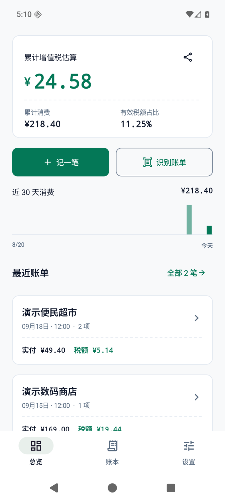
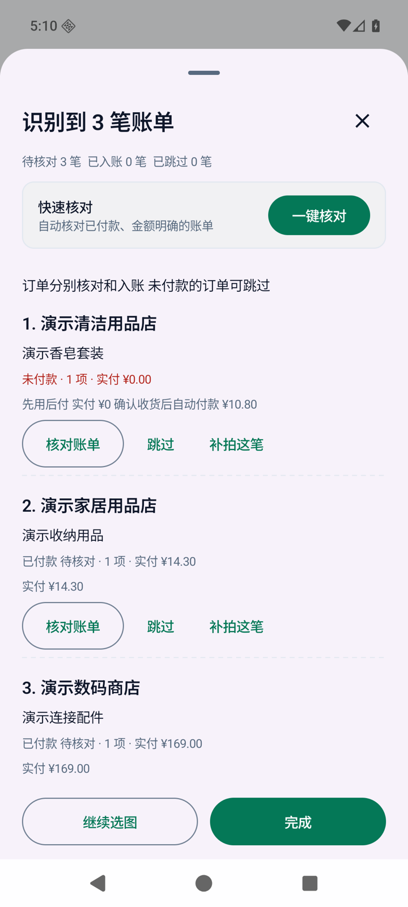
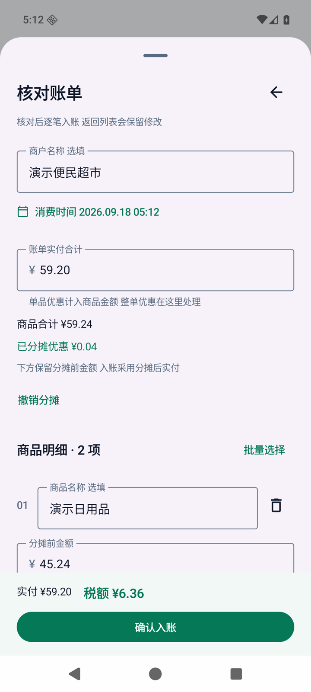
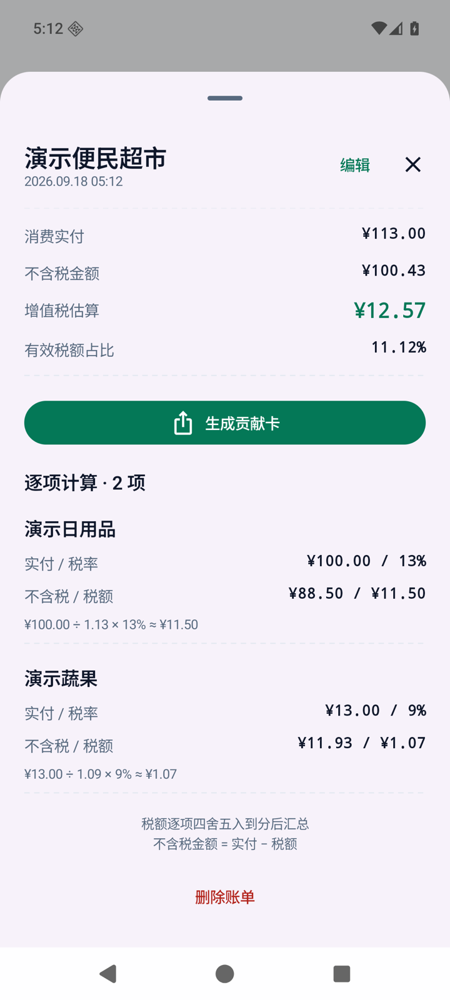

<p align="center">
  
</p>

<h1 align="center">TaxyRay</h1>

<p align="center">
  <strong>AI 读懂账单 看见消费里的税</strong><br/>
  拍照或选图识别商品与实付 逐项拆出价与税
</p>

<p align="center">
  <a href="https://github.com/Changjingjiu/TaxyRay/releases/latest"></a>
  
  <a href="https://github.com/Changjingjiu/TaxyRay/actions/workflows/android.yml"></a>
  <a href="LICENSE"></a>
</p>

<p align="center">
  <a href="https://github.com/Changjingjiu/TaxyRay/releases/latest"><strong>下载 Android 版</strong></a> ·
  <a href="README.en.md">English</a> ·
  <a href="CHANGELOG.md">更新记录</a> ·
  <a href="https://github.com/Changjingjiu/TaxyRay/issues">反馈问题</a>
</p>

## 这是什么

接入你自己的 AI 服务,TaxyRay 就能读懂小票、购物订单截图和电子账单,把每笔消费的实付金额按税率拆成不含税金额与税额,顺手帮你记账。AI 只负责读账单,金额和税额都在本机用精确十进制和整数分计算,确认之后才入账。

> 估算的是消费价格里包含的增值税,不是所有税种的合计,也不代表商户实际缴库的税款

## 功能

- **账单识别** 小票、购物订单截图和电子账单 每轮最多 5 张图片 30 笔账单
- **逐项价税拆分** 13% / 9% / 6% / 0% 与自定义税率 附计算过程与税率依据
- **优惠与抹零分摊** 整单优惠按商品金额比例分摊 尾差用最大余数法补齐
- **一键核对** 已付款、金额明确的账单批量入账 与本机账本和同批账单查重
- **付款状态复核** 未付款订单可跳过 状态不明确时需核实并填写最终实付
- **贡献卡** 分享单笔或累计税额估算 纸本与松石绿两套模板

## 界面

<table>
  <tr>
    <td align="center" width="50%"></td>
    <td align="center" width="50%"></td>
  </tr>
  <tr>
    <td align="center">累计税额估算与最近账单</td>
    <td align="center">连续识别多笔账单 逐笔核对或一键核对</td>
  </tr>
  <tr>
    <td align="center"></td>
    <td align="center"></td>
  </tr>
  <tr>
    <td align="center">整单优惠与抹零 按实付分摊</td>
    <td align="center">每项都给出不含税金额与税额</td>
  </tr>
</table>

<sub>Android 16 模拟器截图 使用演示数据 不代表一次真实 AI 识别</sub>

<table>
  <tr><th width="50%">纸本</th><th width="50%">松石绿</th></tr>
  <tr>
    <td></td>
    <td></td>
  </tr>
</table>

<sub>导出宽度至少 1080 像素 生成时的触觉与彩纸反馈不进入图片</sub>

## 开始使用

1. 从 [Releases](https://github.com/Changjingjiu/TaxyRay/releases/latest) 下载 APK 安装到 Android 8.0 及以上设备
2. 在 **设置 → 账单识别AI** 填写服务地址、支持图片与工具调用的模型 以及你自己的 API Key
3. 回到首页点 **识别账单** 拍照或从相册选图 识别后逐笔核对再确认入账

不想用 AI 也可以手动 **记一笔** 本地记账和计算不需要联网

[识别规则与边界](docs/AI_RECOGNITION.md) · [算法与边界](docs/ALGORITHM.md) · [税率依据](docs/TAX_POLICY.md)

## 数据与隐私

- 账本 识别草稿和 API 配置都只存在本机 没有账号 广告或遥测
- API Key 由 Android Keystore 加密保存 密钥不进入备份
- 只有你主动识别时才联网 请求发往你自己配置的服务
- 备份是明文 JSON / CSV 换设备前请自行保存

[隐私说明](docs/PRIVACY.md) · [安全问题反馈](SECURITY.md) · [更新与签名](docs/UPDATES.md)

## 开发

Kotlin · Jetpack Compose · Room · OkHttp 需要 JDK 17 和 Android SDK 35

```bash
./gradlew :core:test :app:testDebugUnitTest :app:lintDebug :app:assembleDebug
```

[构建与测试](docs/DEVELOPMENT.md) · [参与贡献](CONTRIBUTING.md) · [MIT License](LICENSE) · [第三方组件](THIRD_PARTY_NOTICES.md)
