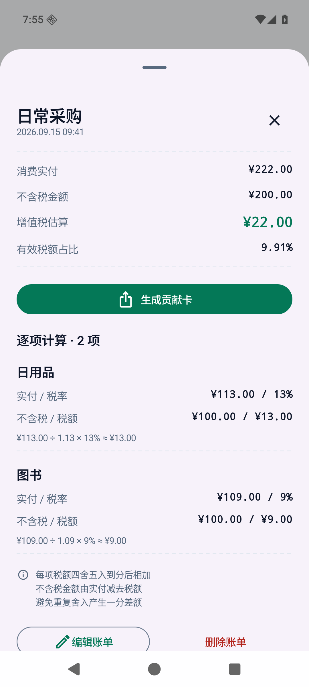

<p align="center">
  
</p>

<h1 align="center">TaxyRay</h1>

<p align="center">
  一个离线优先的 Android 消费账本<br/>
  记下实付金额 拆分价与税 把每笔消费整理成自己的记录
</p>

<p align="center">
  <a href="https://github.com/Changjingjiu/TaxLens/releases/latest"></a>
  
  <a href="https://github.com/Changjingjiu/TaxLens/actions/workflows/android.yml"></a>
  <a href="LICENSE"></a>
</p>

<p align="center">
  <a href="https://github.com/Changjingjiu/TaxLens/releases/latest"><strong>下载 Android 版</strong></a> ·
  <a href="#开始使用">开始使用</a> ·
  <a href="CHANGELOG.md">更新记录</a> ·
  <a href="https://github.com/Changjingjiu/TaxLens/issues">反馈问题</a>
</p>

安装后的应用名称为 **TaxLens** 开源项目标识为 **TaxyRay**

## 看看应用

<table>
  <tr>
    <th width="50%">总览</th>
    <th width="50%">逐项拆分</th>
  </tr>
  <tr>
    <td></td>
    <td></td>
  </tr>
  <tr>
    <td align="center">消费与趋势 一眼看清</td>
    <td align="center">每项金额 都能追溯</td>
  </tr>
</table>

<sub>v0.2.0 模拟器实拍 图片中的账单均为演示数据</sub>

## 日常会用到的功能

| | |
| --- | --- |
| **离线记账**<br/>多商品录入 历史日期 编辑与搜索<br/>无需注册 手动记账无需联网 | **小票识别**<br/>自带模型与 API Key<br/>拍照或选图 识别后确认入账 |
| **价税拆分**<br/>13% / 9% / 6% / 0% 与自定义税率<br/>按项计算 舍入到分后汇总 | **税率参考**<br/>每种税率单独一行<br/>点击类别查看典型代表与适用条件 |
| **本地备份**<br/>导出和导入 JSON / CSV<br/>换设备前自行保存备份 | **在线更新**<br/>从 GitHub 检查稳定版本<br/>下载校验后由 Android 确认安装 |

## 留下一张贡献卡

一笔消费可以生成纸本或松石绿贡献卡 保存到相册或通过系统分享<br/>
生成时有一次触觉和彩纸反馈 导出图片保持干净清晰

<table>
  <tr><th width="50%">纸本</th><th width="50%">松石绿</th></tr>
  <tr>
    <td></td>
    <td></td>
  </tr>
</table>

<sub>应用直接导出的 PNG 示例 导出宽度至少 1080 像素</sub>

## 开始使用

1. 到 [Releases](https://github.com/Changjingjiu/TaxLens/releases/latest) 下载 `.apk` 文件 安装到 Android 8.0 及以上设备
2. 点击 **记一笔** 填写折后实付金额与税率 即可离线使用
3. 想识别小票时 到 **设置 → 小票识别AI** 配置服务地址 模型与密钥

<details>
<summary><strong>小票 AI 怎么配置</strong></summary>

以 DeepSeek 为例

| 设置项 | 填写内容 |
| --- | --- |
| API 地址 | `https://api.deepseek.com` |
| 模型名称 | `deepseek-flash` |
| API Key | 你自己的服务密钥 |
| 自动追加 `/chat/completions` | 开启 |

其他服务须支持图片输入与 Function Calling 也可以关闭自动追加并填写完整请求地址

测试连接只验证简短文本请求 小票图片会在你确认后发送至所选服务 调用费用由服务商计收

[识别规则与边界](docs/AI_RECOGNITION.md)

</details>

<details>
<summary><strong>已有旧版本 如何更新</strong></summary>

旧预览版首次下载 APK 覆盖安装 不要先卸载

从 0.2.0 开始 可通过 **设置 → 检查更新 → 下载更新 → 安装更新** 完成升级

更新前会校验大小 SHA-256 包名 版本和签名 最后由系统确认安装

[更新与签名说明](docs/UPDATES.md)

</details>

## 税额怎么算

```text
税额 = 含税金额 × 税率 ÷ (1 + 税率)
不含税金额 = 含税金额 − 税额
```

例如实付 **¥113.00** 按 **13%** 拆分 得到税额 **¥13.00** 和不含税金额 **¥100.00**

每个商品单独四舍五入到分 再汇总整单 金额使用精确十进制和整数分计算

> 这是个人消费端估算工具 所选税率不等于商户实际适用税率<br/>
> 结果仅供个人参考 不作为发票 完税证明或申报依据

[算法与边界](docs/ALGORITHM.md) · [税率依据](docs/TAX_POLICY.md) · [税率分类说明](docs/TAX_RATE_GUIDE.md)

## 数据由自己保管

- 账本保存在本机 没有账号 广告或遥测
- API 配置使用 Android Keystore 加密 保存的密钥不进入备份
- 测试连接 识别图片 检查更新均由你主动发起
- JSON / CSV 备份为明文 可自行选择保存位置

[完整隐私说明](docs/PRIVACY.md) · [安全问题反馈](SECURITY.md)

## 开发与贡献

Kotlin · Jetpack Compose · Room · OkHttp

配置 **JDK 17** 和 **Android SDK 35** 后运行

```bash
./gradlew :core:test :app:testDebugUnitTest :app:lintDebug :app:assembleDebug
```

[构建与测试](docs/DEVELOPMENT.md) · [参与贡献](CONTRIBUTING.md) · [发行打包](docs/UPDATES.md#维护者打包)

项目采用 [MIT License](LICENSE) 欢迎提交问题和 Pull Request<br/>
第三方组件及许可见 [THIRD_PARTY_NOTICES.md](THIRD_PARTY_NOTICES.md)
